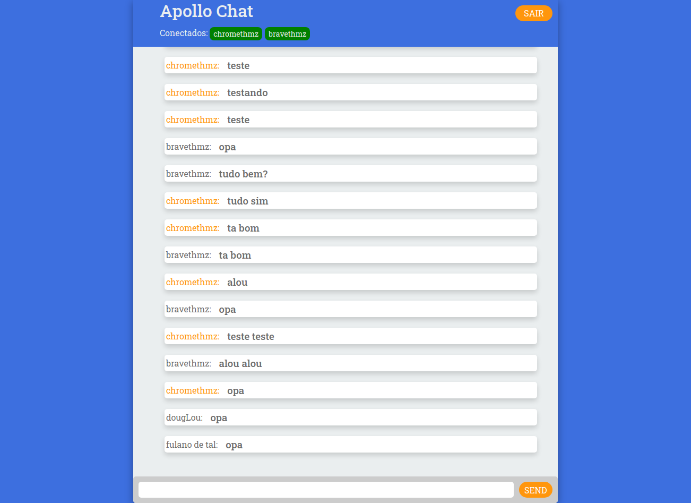

# Open Chat Client Apollo GraphQL

Client do Open Chat, feita com ReactJS + Apollo Client

## Rodando o projeto

Para rodar o projeto localmente, será necessário instalar as dependências descritas no arquivo `package.json` :

`npm install` ou `yarn`

Após isso, basta rodar o comando:

`npm start` ou `yarn start`

Endereço da aplicação: `http://localhost:3000`

### Escolhas técnicas

O Bootstrap da aplicação foi feita através do boilerplate create-react-app.

Para estilização foi utilizado o styled-components.

Para gestão de estados, foram implementados alguns hooks, utilizando a Context API do React. Com isso, as informações sensíveis e todas as requests feitas à api do GraphQL estão concentradas nestes hooks.

A aplicação contém duas rotas, e para o gerenciamento de rotas, foi escolhido o react-router-dom.
